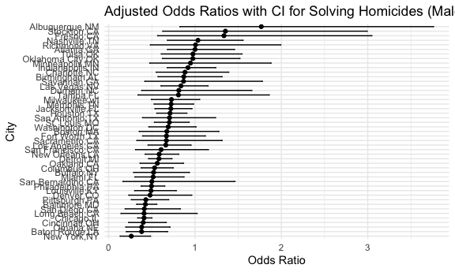
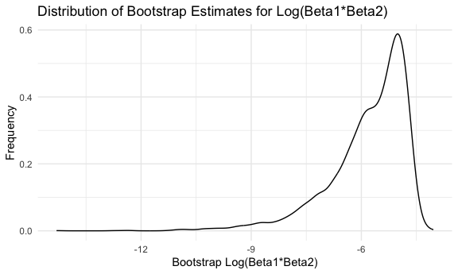
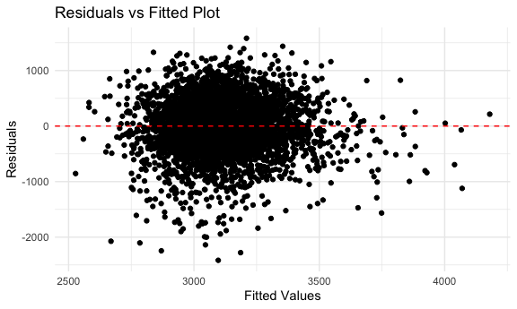
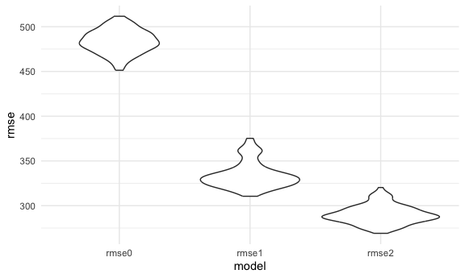

P8105_hw3_my2838
================

``` r
library(tidyverse)
```

    ## ── Attaching core tidyverse packages ──────────────────────── tidyverse 2.0.0 ──
    ## ✔ dplyr     1.1.3     ✔ readr     2.1.4
    ## ✔ forcats   1.0.0     ✔ stringr   1.5.0
    ## ✔ ggplot2   3.4.3     ✔ tibble    3.2.1
    ## ✔ lubridate 1.9.2     ✔ tidyr     1.3.0
    ## ✔ purrr     1.0.2     
    ## ── Conflicts ────────────────────────────────────────── tidyverse_conflicts() ──
    ## ✖ dplyr::filter() masks stats::filter()
    ## ✖ dplyr::lag()    masks stats::lag()
    ## ℹ Use the conflicted package (<http://conflicted.r-lib.org/>) to force all conflicts to become errors

``` r
library(ggplot2)
library(dplyr)
library(p8105.datasets)
library(modelr)
library(mgcv)
```

    ## Loading required package: nlme
    ## 
    ## Attaching package: 'nlme'
    ## 
    ## The following object is masked from 'package:dplyr':
    ## 
    ##     collapse
    ## 
    ## This is mgcv 1.8-42. For overview type 'help("mgcv-package")'.

``` r
set.seed(123)

knitr::opts_chunk$set(
    echo = TRUE,
    warning = FALSE,
  fig.width = 6,
  fig.asp = .6,
  out.width = "90%"
)

theme_set(theme_minimal() + theme(legend.position = "bottom"))

options(
  ggplot2.continuous.colour = "viridis",
  ggplot2.continuous.fill = "viridis"
)

scale_colour_discrete = scale_colour_viridis_d
scale_fill_discrete = scale_fill_viridis_d
```

# Problem 1

``` r
homicide = 
  read_csv("homicide-data.csv") |>
  mutate(city_state = paste(city, state, sep = ",")) |>
  filter(!city_state %in% c("Dallas,TX", "Tulsa,AL", "Phoenix,AZ", "Kansas City,MO") ) |>
  mutate(ifsolve = case_when(
    disposition == "Closed by arrest" ~ TRUE,
    disposition %in% c("Closed without arrest", "Open/No arrest") ~ FALSE
  ),
  victim_age = as.numeric(victim_age)) |>
  filter(victim_race %in% c("Black", "White")) 
```

    ## Rows: 52179 Columns: 12
    ## ── Column specification ────────────────────────────────────────────────────────
    ## Delimiter: ","
    ## chr (9): uid, victim_last, victim_first, victim_race, victim_age, victim_sex...
    ## dbl (3): reported_date, lat, lon
    ## 
    ## ℹ Use `spec()` to retrieve the full column specification for this data.
    ## ℹ Specify the column types or set `show_col_types = FALSE` to quiet this message.

``` r
md_homicide = 
  homicide |>
  filter(city_state == "Baltimore,MD")

md_glm = glm(ifsolve ~ victim_race + victim_age + victim_sex, family = binomial, data = md_homicide) 
md_tidy = broom::tidy(md_glm)

md_estimate = 
  md_tidy |>
  filter(term == "victim_sexMale") |>
  pull("estimate") |>
  exp()

md_ci = 
  confint(md_glm)["victim_sexMale",] |>
  exp()
```

    ## Waiting for profiling to be done...

So the estimate proportion of homicides that are unsolved in the city of
Baltimore, MD is 0.4255117, and the confidence interval is \[0.3241908,
0.5575508\].

``` r
glm_model <- function(df) {
  glm_model = glm(ifsolve ~ victim_age + victim_sex + victim_race, family = binomial, data = df)
  tidy_glm = broom::tidy(glm_model)
  confint_glm = confint(glm_model)
  
  tidy_glm |>
    filter(term == "victim_sexMale") %>%
    mutate(
      or = exp(estimate),
      lower_ci = exp(confint_glm["victim_sexMale", "2.5 %"]),
      upper_ci = exp(confint_glm["victim_sexMale", "97.5 %"])
    )
}

city_models <- homicide |>
  group_by(city_state) |>
  nest() |>
  mutate(model = purrr::map(data, glm_model)) |>
  select(-data) |>
  unnest(model)
```

    ## Waiting for profiling to be done...
    ## Waiting for profiling to be done...
    ## Waiting for profiling to be done...
    ## Waiting for profiling to be done...
    ## Waiting for profiling to be done...
    ## Waiting for profiling to be done...
    ## Waiting for profiling to be done...
    ## Waiting for profiling to be done...
    ## Waiting for profiling to be done...
    ## Waiting for profiling to be done...
    ## Waiting for profiling to be done...
    ## Waiting for profiling to be done...
    ## Waiting for profiling to be done...
    ## Waiting for profiling to be done...
    ## Waiting for profiling to be done...
    ## Waiting for profiling to be done...
    ## Waiting for profiling to be done...
    ## Waiting for profiling to be done...
    ## Waiting for profiling to be done...
    ## Waiting for profiling to be done...
    ## Waiting for profiling to be done...
    ## Waiting for profiling to be done...
    ## Waiting for profiling to be done...
    ## Waiting for profiling to be done...
    ## Waiting for profiling to be done...
    ## Waiting for profiling to be done...
    ## Waiting for profiling to be done...
    ## Waiting for profiling to be done...
    ## Waiting for profiling to be done...
    ## Waiting for profiling to be done...
    ## Waiting for profiling to be done...
    ## Waiting for profiling to be done...
    ## Waiting for profiling to be done...
    ## Waiting for profiling to be done...
    ## Waiting for profiling to be done...
    ## Waiting for profiling to be done...
    ## Waiting for profiling to be done...
    ## Waiting for profiling to be done...
    ## Waiting for profiling to be done...
    ## Waiting for profiling to be done...
    ## Waiting for profiling to be done...
    ## Waiting for profiling to be done...
    ## Waiting for profiling to be done...
    ## Waiting for profiling to be done...
    ## Waiting for profiling to be done...
    ## Waiting for profiling to be done...
    ## Waiting for profiling to be done...

``` r
ggplot(city_models, aes(x = reorder(city_state, or), y = or)) +
  geom_point() +
  geom_errorbar(aes(ymin = lower_ci, ymax = upper_ci), width = 0.25) +
  coord_flip() +  
  xlab("City") +
  ylab("Odds Ratio") +
  ggtitle("Adjusted Odds Ratios with CI for Solving Homicides (Male vs Female Victims)")
```


\# Problem 2

Firstly, I download Central Park weather data.

``` r
weather_df = 
  rnoaa::meteo_pull_monitors(
    c("USW00094728"),
    var = c("PRCP", "TMIN", "TMAX"), 
    date_min = "2022-01-01",
    date_max = "2022-12-31") |>
  mutate(
    name = recode(id, USW00094728 = "CentralPark_NY"),
    tmin = tmin / 10,
    tmax = tmax / 10) |>
  select(name, id, everything())
```

    ## using cached file: /Users/mia/Library/Caches/org.R-project.R/R/rnoaa/noaa_ghcnd/USW00094728.dly

    ## date created (size, mb): 2023-10-01 12:27:32.339329 (8.525)

    ## file min/max dates: 1869-01-01 / 2023-09-30

And I fitted a simple linear regression with `tmax` as the response with
`tmin` and `prcp` as the predictors.

``` r
lm = lm(tmax ~ tmin + prcp, data = weather_df)
   broom::tidy(lm)
```

    ## # A tibble: 3 × 5
    ##   term        estimate std.error statistic   p.value
    ##   <chr>          <dbl>     <dbl>     <dbl>     <dbl>
    ## 1 (Intercept)  8.04      0.230      35.0   4.39e-118
    ## 2 tmin         1.01      0.0162     62.7   1.43e-196
    ## 3 prcp        -0.00154   0.00210    -0.733 4.64e-  1

``` r
   broom::glance(lm)
```

    ## # A tibble: 1 × 12
    ##   r.squared adj.r.squared sigma statistic   p.value    df logLik   AIC   BIC
    ##       <dbl>         <dbl> <dbl>     <dbl>     <dbl> <dbl>  <dbl> <dbl> <dbl>
    ## 1     0.916         0.915  2.96     1972. 2.19e-195     2  -912. 1832. 1848.
    ## # ℹ 3 more variables: deviance <dbl>, df.residual <int>, nobs <int>

``` r
res =   
  weather_df |> 
  modelr::bootstrap(n = 5000) |> 
  mutate(
    models = map(strap, \(df) lm(tmax ~ tmin + prcp, data = df)),
    results = map(models, broom::tidy),
    results2 = map(models, broom::glance)) |> 
  select(results, results2) |> 
  unnest(results2) |> 
  select(r.squared, results) |>
  unnest(results) |>
  select(term, estimate, r.squared) |>
  group_by(term) |>
  mutate(group_id = ceiling((row_number() ))) %>%
  ungroup() |>
  pivot_wider(
    names_from = term,
    values_from = estimate,
  ) |>
  mutate(log_bata = log ( tmin * abs(prcp)))
```

``` r
ggplot(res, aes(x = r.squared)) +
  geom_density()+
  labs(x = "Bootstrap R-squared)", y = "Frequency") +
  ggtitle("Distribution of Bootstrap Estimates for r̂²")
```


The goodness of fit of a model can be measured by $\hat{r}^2$. In the
observed data, estimates of $\hat{r}^2$ range from about 0.90 to 0.94.
Most of the estimates hover around 0.92, indicating quite a good fit of
the model. Additionally, the distribution of $\hat{r}^2$ is slightly
left-skewed.

``` r
ggplot(res, aes(x = log_bata)) +
  geom_density()+
  labs(x = "Bootstrap Log(Beta1*Beta2)", y = "Frequency") +
  ggtitle("Distribution of Bootstrap Estimates for Log(Beta1*Beta2)")
```



The logarithm of the product of estimates,
$log(\hat{\beta_1} * \hat{\beta_2})$, varied from approximately -9 to
-7. A higher value in this range indicates a stronger influence of the
two factors. Most values were centered around -6, implying a moderate
influence. Additionally, the distribution of these values is
left-skewed. (Because one of the parameters was negative, which made
logarithmic transformation impossible, I first took the absolute value
of $\hat{\beta_2}$.)

# Problem 3

Firstly, I load and clean the data for regression analysis.

``` r
birthweight = read.csv('birthweight.csv') 

sum(is.na(birthweight))
```

    ## [1] 0

There is no missing data. So next I converted numeric to factor where
appropriate.

``` r
vars = c('babysex', 'frace', 'malform', 'mrace')
birthweight[vars] <- lapply(birthweight[vars], factor)
```

Based on a hypothesized structure for the factors that underly
birthweight, I suggest that mother’s pre-pregnancy BMI (`ppbmi`) and
weight (`ppwt`), mother’s weight gain during pregnancy (`wtgain`), as
well as presence of malformations(`malform`) that could affect weight
could have a deep influence to baby’s birthweight.

Here is my regression model.

``` r
mymodel = lm(bwt ~ wtgain + ppwt + ppbmi + malform, data = birthweight)
summary(mymodel)
```

    ## 
    ## Call:
    ## lm(formula = bwt ~ wtgain + ppwt + ppbmi + malform, data = birthweight)
    ## 
    ## Residuals:
    ##      Min       1Q   Median       3Q      Max 
    ## -2417.05  -278.91    23.38   312.29  1581.11 
    ## 
    ## Coefficients:
    ##              Estimate Std. Error t value Pr(>|t|)    
    ## (Intercept) 2366.1130    54.3634  43.524  < 2e-16 ***
    ## wtgain        11.8868     0.6747  17.617  < 2e-16 ***
    ## ppwt           9.1497     0.6979  13.110  < 2e-16 ***
    ## ppbmi        -29.8525     4.4365  -6.729 1.93e-11 ***
    ## malform1     -45.5368   125.0027  -0.364    0.716    
    ## ---
    ## Signif. codes:  0 '***' 0.001 '**' 0.01 '*' 0.05 '.' 0.1 ' ' 1
    ## 
    ## Residual standard error: 483 on 4337 degrees of freedom
    ## Multiple R-squared:  0.1112, Adjusted R-squared:  0.1104 
    ## F-statistic: 135.7 on 4 and 4337 DF,  p-value: < 2.2e-16

Because the coefficient of `malform` is not statistically significant, I
removed the varible from my model and fitted the regression model again.

``` r
mymodel = lm(bwt ~ wtgain + ppwt + ppbmi, data = birthweight)
summary(mymodel)
```

    ## 
    ## Call:
    ## lm(formula = bwt ~ wtgain + ppwt + ppbmi, data = birthweight)
    ## 
    ## Residuals:
    ##      Min       1Q   Median       3Q      Max 
    ## -2416.89  -278.65    23.55   312.45  1581.37 
    ## 
    ## Coefficients:
    ##              Estimate Std. Error t value Pr(>|t|)    
    ## (Intercept) 2366.1786    54.3577  43.530  < 2e-16 ***
    ## wtgain        11.8791     0.6743  17.616  < 2e-16 ***
    ## ppwt           9.1517     0.6978  13.114  < 2e-16 ***
    ## ppbmi        -29.8667     4.4359  -6.733 1.88e-11 ***
    ## ---
    ## Signif. codes:  0 '***' 0.001 '**' 0.01 '*' 0.05 '.' 0.1 ' ' 1
    ## 
    ## Residual standard error: 483 on 4338 degrees of freedom
    ## Multiple R-squared:  0.1112, Adjusted R-squared:  0.1106 
    ## F-statistic:   181 on 3 and 4338 DF,  p-value: < 2.2e-16

``` r
birthweight_pre =
  birthweight |>
  add_predictions(mymodel) |>
  add_residuals(mymodel)

ggplot(birthweight_pre, aes(x = pred, y = resid)) +
  geom_point() +
  geom_hline(yintercept = 0, linetype = "dashed", color = "red") +
  xlab("Fitted Values") +
  ylab("Residuals") +
  ggtitle("Residuals vs Fitted Plot")
```



All variables had statistically significant coefficients, which meas the
mother’s pre-pregnancy BMI (`ppbmi`) and weight (`ppwt`), mother’s
weight gain during pregnancy (`wtgain`) all related to the baby’s
birthweight.

Now, let’s compare my model to given models.

``` r
model1 = lm(bwt ~ blength + gaweeks, data = birthweight)
summary(model1)
```

    ## 
    ## Call:
    ## lm(formula = bwt ~ blength + gaweeks, data = birthweight)
    ## 
    ## Residuals:
    ##     Min      1Q  Median      3Q     Max 
    ## -1709.6  -215.4   -11.4   208.2  4188.8 
    ## 
    ## Coefficients:
    ##              Estimate Std. Error t value Pr(>|t|)    
    ## (Intercept) -4347.667     97.958  -44.38   <2e-16 ***
    ## blength       128.556      1.990   64.60   <2e-16 ***
    ## gaweeks        27.047      1.718   15.74   <2e-16 ***
    ## ---
    ## Signif. codes:  0 '***' 0.001 '**' 0.01 '*' 0.05 '.' 0.1 ' ' 1
    ## 
    ## Residual standard error: 333.2 on 4339 degrees of freedom
    ## Multiple R-squared:  0.5769, Adjusted R-squared:  0.5767 
    ## F-statistic:  2958 on 2 and 4339 DF,  p-value: < 2.2e-16

``` r
model2 = lm(bwt ~ bhead * blength * babysex, data = birthweight)
summary(model2)
```

    ## 
    ## Call:
    ## lm(formula = bwt ~ bhead * blength * babysex, data = birthweight)
    ## 
    ## Residuals:
    ##      Min       1Q   Median       3Q      Max 
    ## -1132.99  -190.42   -10.33   178.63  2617.96 
    ## 
    ## Coefficients:
    ##                          Estimate Std. Error t value Pr(>|t|)    
    ## (Intercept)            -7176.8170  1264.8397  -5.674 1.49e-08 ***
    ## bhead                    181.7956    38.0542   4.777 1.84e-06 ***
    ## blength                  102.1269    26.2118   3.896 9.92e-05 ***
    ## babysex2                6374.8684  1677.7669   3.800 0.000147 ***
    ## bhead:blength             -0.5536     0.7802  -0.710 0.478012    
    ## bhead:babysex2          -198.3932    51.0917  -3.883 0.000105 ***
    ## blength:babysex2        -123.7729    35.1185  -3.524 0.000429 ***
    ## bhead:blength:babysex2     3.8781     1.0566   3.670 0.000245 ***
    ## ---
    ## Signif. codes:  0 '***' 0.001 '**' 0.01 '*' 0.05 '.' 0.1 ' ' 1
    ## 
    ## Residual standard error: 287.7 on 4334 degrees of freedom
    ## Multiple R-squared:  0.6849, Adjusted R-squared:  0.6844 
    ## F-statistic:  1346 on 7 and 4334 DF,  p-value: < 2.2e-16

It can be seen that all coefficients are significant. So nwxt I fit
models to training data and obtain corresponding RMSEs for the testing
data, and plot the prediction error distribution for each model.

``` r
cv_df =
  crossv_mc(birthweight, 100) |> 
  mutate(
    train = map(train, as_tibble),
    test = map(test, as_tibble))

cv_df = 
  cv_df |> 
  mutate(
    map_model0  = map(train, \(df) lm(bwt ~ wtgain + ppwt + ppbmi, data = df)),
    map_model1  = map(train, \(df) lm(bwt ~ blength + gaweeks, data = df)),
    map_model2  = map(train, \(df) lm(bwt ~ bhead * blength * babysex, data = df))) |>
  mutate(
    rmse0 = map2_dbl(map_model0, test, \(mod, df) rmse(model = mod, data = df)),
    rmse1 = map2_dbl(map_model1, test, \(mod, df) rmse(model = mod, data = df)),
    rmse2 = map2_dbl(map_model2, test, \(mod, df) rmse(model = mod, data = df)))

cv_df |> 
  select(starts_with("rmse")) |> 
  pivot_longer(
    everything(),
    names_to = "model", 
    values_to = "rmse",
    names_prefix = "rmse_") |> 
  mutate(model = fct_inorder(model)) |> 
  ggplot(aes(x = model, y = rmse)) + 
  geom_violin() 
```



From the anaylsis obtained through cross-validation, it’s evident that
the last model performs the best as it exhibits the lowest RMSE. This is
likely attributed to its consideration of variable interactions,
enabling it to provide a superior fit to the data.
