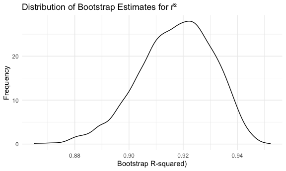

P8105_hw3_my2838
================

``` r
library(tidyverse)
```

    ## ── Attaching core tidyverse packages ──────────────────────── tidyverse 2.0.0 ──
    ## ✔ dplyr     1.1.3     ✔ readr     2.1.4
    ## ✔ forcats   1.0.0     ✔ stringr   1.5.0
    ## ✔ ggplot2   3.4.3     ✔ tibble    3.2.1
    ## ✔ lubridate 1.9.2     ✔ tidyr     1.3.0
    ## ✔ purrr     1.0.2     
    ## ── Conflicts ────────────────────────────────────────── tidyverse_conflicts() ──
    ## ✖ dplyr::filter() masks stats::filter()
    ## ✖ dplyr::lag()    masks stats::lag()
    ## ℹ Use the conflicted package (<http://conflicted.r-lib.org/>) to force all conflicts to become errors

``` r
library(ggplot2)
library(dplyr)
library(p8105.datasets)

set.seed(123)

knitr::opts_chunk$set(
    echo = TRUE,
    warning = FALSE,
  fig.width = 6,
  fig.asp = .6,
  out.width = "90%"
)

theme_set(theme_minimal() + theme(legend.position = "bottom"))

options(
  ggplot2.continuous.colour = "viridis",
  ggplot2.continuous.fill = "viridis"
)

scale_colour_discrete = scale_colour_viridis_d
scale_fill_discrete = scale_fill_viridis_d
```

# Problem 1

``` r
homicide = 
  read_csv("homicide-data.csv") |>
  mutate(city_state = paste(city, state, sep = ",")) |>
  filter(!city_state %in% c("Dallas,TX", "Tulsa,AL", "Phoenix,AZ", "Kansas City,MO") ) |>
  mutate(ifsolve = case_when(
    disposition == "Closed by arrest" ~ TRUE,
    disposition %in% c("Closed without arrest", "Open/No arrest") ~ FALSE
  ),
  victim_age = as.numeric(victim_age)) |>
  filter(victim_race %in% c("Black", "White")) 
```

    ## Rows: 52179 Columns: 12
    ## ── Column specification ────────────────────────────────────────────────────────
    ## Delimiter: ","
    ## chr (9): uid, victim_last, victim_first, victim_race, victim_age, victim_sex...
    ## dbl (3): reported_date, lat, lon
    ## 
    ## ℹ Use `spec()` to retrieve the full column specification for this data.
    ## ℹ Specify the column types or set `show_col_types = FALSE` to quiet this message.

``` r
md_homicide = 
  homicide |>
  filter(city_state == "Baltimore,MD")

md_glm = glm(ifsolve ~ victim_race + victim_age + victim_sex, family = binomial, data = md_homicide) 
md_tidy = broom::tidy(md_glm)

md_estimate = 
  md_tidy |>
  filter(term == "victim_sexMale") |>
  pull("estimate") |>
  exp()

md_ci = 
  confint(md_glm)["victim_sexMale",] |>
  exp()
```

    ## Waiting for profiling to be done...

So the estimate proportion of homicides that are unsolved in the city of
Baltimore, MD is 0.4255117, and the confidence interval is \[0.3241908,
0.5575508\].

``` r
glm_model <- function(df) {
  glm_model = glm(ifsolve ~ victim_age + victim_sex + victim_race, family = binomial, data = df)
  tidy_glm = broom::tidy(glm_model)
  confint_glm = confint(glm_model)
  
  tidy_glm |>
    filter(term == "victim_sexMale") %>%
    mutate(
      or = exp(estimate),
      lower_ci = exp(confint_glm["victim_sexMale", "2.5 %"]),
      upper_ci = exp(confint_glm["victim_sexMale", "97.5 %"])
    )
}

city_models <- homicide |>
  group_by(city_state) |>
  nest() |>
  mutate(model = purrr::map(data, glm_model)) |>
  select(-data) |>
  unnest(model)
```

    ## Waiting for profiling to be done...
    ## Waiting for profiling to be done...
    ## Waiting for profiling to be done...
    ## Waiting for profiling to be done...
    ## Waiting for profiling to be done...
    ## Waiting for profiling to be done...
    ## Waiting for profiling to be done...
    ## Waiting for profiling to be done...
    ## Waiting for profiling to be done...
    ## Waiting for profiling to be done...
    ## Waiting for profiling to be done...
    ## Waiting for profiling to be done...
    ## Waiting for profiling to be done...
    ## Waiting for profiling to be done...
    ## Waiting for profiling to be done...
    ## Waiting for profiling to be done...
    ## Waiting for profiling to be done...
    ## Waiting for profiling to be done...
    ## Waiting for profiling to be done...
    ## Waiting for profiling to be done...
    ## Waiting for profiling to be done...
    ## Waiting for profiling to be done...
    ## Waiting for profiling to be done...
    ## Waiting for profiling to be done...
    ## Waiting for profiling to be done...
    ## Waiting for profiling to be done...
    ## Waiting for profiling to be done...
    ## Waiting for profiling to be done...
    ## Waiting for profiling to be done...
    ## Waiting for profiling to be done...
    ## Waiting for profiling to be done...
    ## Waiting for profiling to be done...
    ## Waiting for profiling to be done...
    ## Waiting for profiling to be done...
    ## Waiting for profiling to be done...
    ## Waiting for profiling to be done...
    ## Waiting for profiling to be done...
    ## Waiting for profiling to be done...
    ## Waiting for profiling to be done...
    ## Waiting for profiling to be done...
    ## Waiting for profiling to be done...
    ## Waiting for profiling to be done...
    ## Waiting for profiling to be done...
    ## Waiting for profiling to be done...
    ## Waiting for profiling to be done...
    ## Waiting for profiling to be done...
    ## Waiting for profiling to be done...

# Problem 2

``` r
weather_df = 
  rnoaa::meteo_pull_monitors(
    c("USW00094728"),
    var = c("PRCP", "TMIN", "TMAX"), 
    date_min = "2022-01-01",
    date_max = "2022-12-31") |>
  mutate(
    name = recode(id, USW00094728 = "CentralPark_NY"),
    tmin = tmin / 10,
    tmax = tmax / 10) |>
  select(name, id, everything())
```

    ## using cached file: /Users/mia/Library/Caches/org.R-project.R/R/rnoaa/noaa_ghcnd/USW00094728.dly

    ## date created (size, mb): 2023-10-01 12:27:32.339329 (8.525)

    ## file min/max dates: 1869-01-01 / 2023-09-30

``` r
lm = lm(tmax ~ tmin + prcp, data = weather_df)
   broom::tidy(lm)
```

    ## # A tibble: 3 × 5
    ##   term        estimate std.error statistic   p.value
    ##   <chr>          <dbl>     <dbl>     <dbl>     <dbl>
    ## 1 (Intercept)  8.04      0.230      35.0   4.39e-118
    ## 2 tmin         1.01      0.0162     62.7   1.43e-196
    ## 3 prcp        -0.00154   0.00210    -0.733 4.64e-  1

``` r
   broom::glance(lm)
```

    ## # A tibble: 1 × 12
    ##   r.squared adj.r.squared sigma statistic   p.value    df logLik   AIC   BIC
    ##       <dbl>         <dbl> <dbl>     <dbl>     <dbl> <dbl>  <dbl> <dbl> <dbl>
    ## 1     0.916         0.915  2.96     1972. 2.19e-195     2  -912. 1832. 1848.
    ## # ℹ 3 more variables: deviance <dbl>, df.residual <int>, nobs <int>

``` r
res =   
  weather_df |> 
  modelr::bootstrap(n = 5000) |> 
  mutate(
    models = map(strap, \(df) lm(tmax ~ tmin + prcp, data = df)),
    results = map(models, broom::tidy),
    results2 = map(models, broom::glance)) |> 
  select(results, results2) |> 
  unnest(results2) |> 
  select(r.squared, results) |>
  unnest(results) |>
  select(term, estimate, r.squared) |>
  group_by(term) |>
  mutate(group_id = ceiling((row_number() ))) %>%
  ungroup() |>
  pivot_wider(
    names_from = term,
    values_from = estimate,
  ) |>
  mutate(log_bata = log ( tmin * abs(prcp)))
```

``` r
ggplot(res, aes(x = r.squared)) +
  geom_density()+
  labs(x = "Bootstrap R-squared)", y = "Frequency") +
  ggtitle("Distribution of Bootstrap Estimates for r̂²")
```



The goodness of fit of a model can be measured by $\hat{r}^2$. In the
observed data, estimates of $\hat{r}^2$ range from about 0.90 to 0.94.
Most of the estimates hover around 0.92, indicating quite a good fit of
the model. Additionally, the distribution of $\hat{r}^2$ is slightly
left-skewed.

``` r
ggplot(res, aes(x = log_bata)) +
  geom_density()+
  labs(x = "Bootstrap Log(Beta1*Beta2)", y = "Frequency") +
  ggtitle("Distribution of Bootstrap Estimates for Log(Beta1*Beta2)")
```


The logarithm of the product of estimates,
$log(\hat{\beta_1} * \hat{\beta_2})$, varied from approximately -9 to
-7. A higher value in this range indicates a stronger influence of the
two factors. Most values were centered around -6, implying a moderate
influence. Additionally, the distribution of these values is
left-skewed. (Because one of the parameters was negative, which made
logarithmic transformation impossible, I first took the absolute value
of $\hat{\beta_2}$.)
